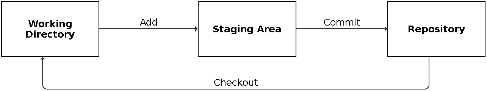
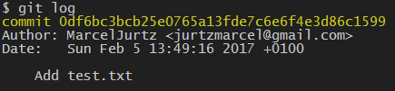
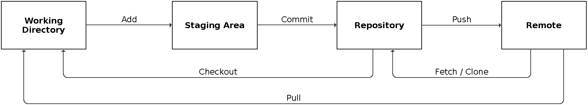
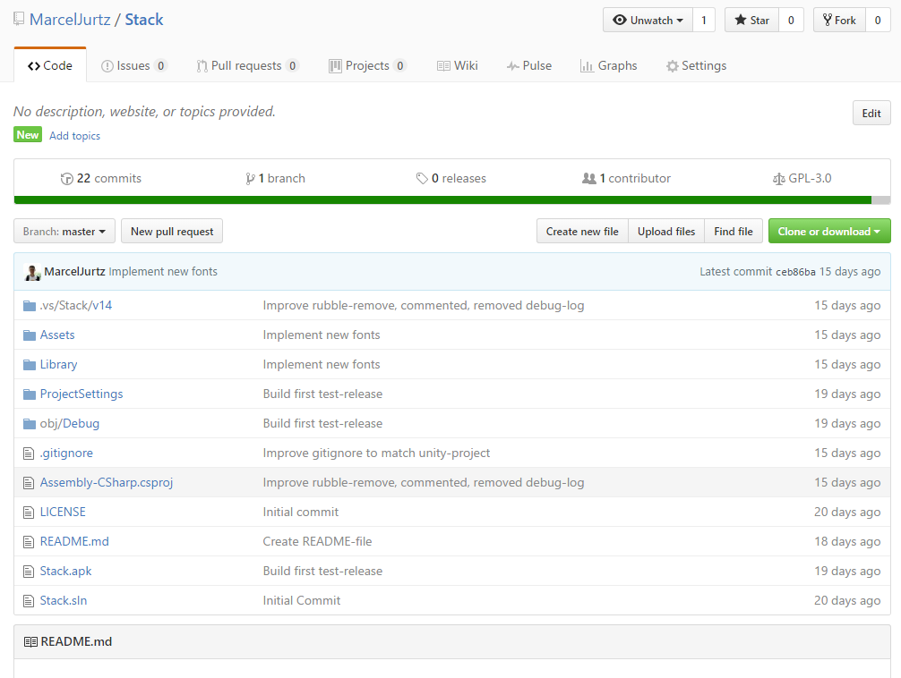
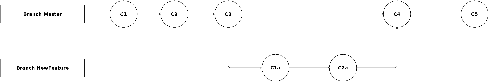

# Git Tutorial

Dieses Tutorial deckt nur einen Teil der Versionskontrolle mit Git ab, alle abgebildeten Parameter stellen zudem nur eine kleine Teilmenge der verfügbaren Optionen dar.

## Git?

[Wikipedia:](https://de.wikipedia.org/wiki/Git)
> Git [ɡɪt] ist eine freie Software zur verteilten Versionsverwaltung von Dateien, die durch Linus Torvalds initiiert wurde. Der Name Git bedeutet umgangssprachlich im Englischen Blödmann.

Git ist ein beliebtes System zur Versionskontrolle. Projekte werden als *Repositories* angelegt und verwaltet. Repositories können lokal und auf Servern abgelegt werden. Beliebte Anbieter solcher sind beispielsweise:

* [Github](https://github.com)
* [GitLab](https://about.gitlab.com/)
* [BitBucket](https://bitbucket.org)

## Installation

* Linux (Debian-basiert)

  ```Bash
  apt-get install git-all
  ```
  
* [Windows](https://git-for-windows.github.io/)
* [Mac](http://git-scm.com/download/mac)

## Bereiche

Git-Repositories werden in die Bereiche *Working Directory*, *Staging Area* und *Repository* unterteilt. Das Working Directory repräsentiert das lokale Abbild des Repositories.
Änderungen an den Daten werden hier gespeichert. Das Repository ist das Gesamt-Projekt der beteiligten Entwickler. Mittels der Staging Area kann ein Entwickler entscheiden, welche Änderungen von seinem lokalen Projekt in das Repository übernommen werden sollen.



## Grundlegende Verwaltung eines Repositories

Sämtliche Git-Befehle werden vom Keyword 'git' eingeleitet:

Initialisierung eines neuen Git-Repositories:

```Bash
# Neues Repository
git init

# Kopie eines bestehenden Repositories
git clone /pfad/zum/repository
```

Ändern / Erstellen von Dateien: test.txt

```Bash
# Übersicht des Repositories:
git status
# -> test.txt ist rot dargestellt

# Aufteilung in Bereiche:
# Untracked Files: Neu
# Changes not staged for commit: Bearbeitet

# Parameter:
# -u: Fügt alle bearbeiteten Dateien hinzu, aber keine neuen Dateien.
# -A: Fügt alle Dateien hinzu (Alternativ: git add . )


# Hinzufügen zum Index
git add test.txt
# -> test.txt ist grün dargestellt

# Hinzufügen zum Repository
git add -m "Add test"
```

Jeder Commit wird durch Anhängen einer Nachricht mit dem Parameter *m* dokumentiert.
Jeder Commit lässt sich somit identifizieren.

Git [Namenskonvention](https://github.com/erlang/otp/wiki/Writing-good-commit-messages) sieht hierbei vor, den Text von Commit-Nachrichten kurz (<50 Zeichen), sowie aussagekräftig und in Präsens-Schreibweise zu formulieren.

```Bash
# Ausgabe aller Commits in chronologischer Reihenfolge:
git log
```

Der Output dieses Befehl sieht wie folgt aus:



* SHA1-Checksum
* Name des Autors
* E-Mail-Adresse des Autors

## Setzen von Name & E-Mail-Adresse

Diese Konfiguration ist einmalig zu setzen.

```Bash
git config --global user.name "Marcel Jurtz"
git config --global user.email jurtzmarcel@gmail.com
```

Hierdurch werden die Daten global für alle Repositories gesetzt.
Sollen für einzelne Projekte andere Daten genutzt werden, so können diese mit demselben Befehl, ohne *--global* lokal überschrieben werden.

## HEAD

Im Folgenden fällt das Keyword HEAD. Hierunter versteht man den aktuellsten Commit des aktuellen Branch (hierzu später mehr).

## Verwendung von Remotes

Ein Remote ist ein entferntes Repository, also beispielsweise ein unter Github gehostetes Repository.



Im Folgenden verwende ich Github als Remote.

Nach dem Erstellen eines Accounts bei [Github](https://www.github.com) werden unter der Registerkarte *Repositories* die vorhanden Repositories aufgelistet, hier können außerdem neue Repositories angelegt werden.

Es wird zu Beginn die Möglichkeit gegeben, eine README-, sowie eine license- und eine .gitignore-Datei anzulegen:

* README

  Die README-Datei wird Nutzern angezeigt, die die Seite des Repositories aufrufen und liegt als .md-Datei (Markdown) vor. Markdown ist eine einfache Textauszeichnungssprache, die schnelle Möglichkeiten zu übersichtlicher Formatierung bietet.

  In dieser Datei sollten Funktionalitäten und Anwendung des Repositories verdeutlicht werden.

* license

  Alle Repositories auf Github sind öffentlich, mittels der license-Datei kann die Nutzung eingeschränkt werden. Github bietet einige vorgefertigte Lizenzen an, mit dem blauen Info-Icon neben dem Dropdown-Menü wird ein kurzer Vergleich der Lizenzen aufgerufen, der die Auswahl erleichert.

* .gitignore

  Diese Datei listet alle Dateiendungen bzw. Dateien, die von der Versionskontrolle ignoriert werden. Github bietet hierzu eine Vielzahl an vorgefertigten Templates, die direkt eingebunden werden können. Die Datei kann natürlich manuell angepasst werden.

Ein Git-Repository sieht wie folgt aus:



Die Startseite bietet einige Überblicke über das Repository, beispielsweise im Container über den enthaltenen Dateien die Anzahl an Commits, Anzahl der Branches, Lizenz etc., aber auch die verwendeten Programmiersprachen durch farbliche Kennzeichnung.

Sobald das Repository erstellt wurde, kann es mit dem Befehl

```Bash
git remote add origin pfad
```

zum lokalen Repository hinzugefügt werden.

Um nun Änderungen vom lokalen Repository hochzuladen, wird der Befehl

```Bash
git push origin master
```

verwendet.

Um Änderungen vom Remote-Repository zu beziehen, wird anschließend der Befehl

```Bash
git pull origin master
```

verwendet.

## Merging

Angenommen, Nutzer A und Nutzer B bearbeiten gemeinsam ein Repository,
können diese mit den oben dargestellten Möglichkeiten zwar gemeinsam entwickeln,
jedoch ergibt sich ein Problem, wenn beide die gleiche Datei verändern und hochladen wollen.

Als Beispiel existiert die Datei test.txt mit dem Inhalt

```
Hallo
```

im Remote-Repository.
Mit dem pull-Befehl beziehen A und B diese Datei in ihre lokalen Repositories.
Die Änderungen sehen nun wie folgt aus:

Version von A:

```
Hallo, ich bin A!
```

Version von B:

```
Hallo, ich bin B!
```

Wollen nun beide ihre Version mittels *push* zum Remote-Repository hinzufügen, kommt es zu einem sogenannten *Merge-Conflict*. Die Version, die zuerst hochgeladen wird, wird ganz normal akzeptiert. Beim zweiten push erkennt git jedoch, dass im Remote-Repository Änderungen vorliegen, die nicht mit *pull* heruntergeladen wurden.

Angenommen, Bs push wurde akzeptiert, erhält A eine Fehlermeldung, welche wie folgt aussieht:

```
CONFLICT (content): Merge conflict in test.txt
Automatic merge failed; fix conflicts and then commit the result.
```

Die Änderungen von B werden in die entsprechend Datei inkludiert, welche anschließend wie folgt aussieht:

```
<<<<<<< HEAD:test.txt
Hallo, ich bin B!
=======
Hallo, ich bin A!
>>>>>>> commit-text:test.txt
```

A muss nun entscheiden, welcher Inhalt nun behalten werden soll und passt die Datei entsprechend an. Nun sieht diese wie folgt aus:

```
Hallo, wir sind A und B!
```

Anschließend vermerkt er den Merge-Conflict:

```Bash
git add test.txt
git commit -m "Resolve Merge Conflict"
```

## Branching

Git verwendet sogenannte Branches zur Entwicklung und Einführung neuer Features.



Ein neuer Branch wird mit dem Befehl

```Bash
git branch branch_name
```

erstellt.

Alle vorhandenen Branches werden mit dem Befehl

```Bash
git branch
```

angezeigt. Der aktuelle Branch wird dabei mit einem Stern markiert.
Hier wird ersichtlich, dass der Standard-Branch den Namen *master* hat.
Der zuvor genutzte Befehl *git push origin master* bezieht sich also auf diesen Branch.

Soll ein anderer Branch zum Remote-Repository hinzugefügt werden, wird der Name des gewünschten Branches statt *master* eingesetzt.

Branches können mit dem Befehl

```Bash
git checkout branch_name
```

gewechselt werden. Dadurch werde die Dateien im Working-Directory auf den Stand des Branches geändert.

Die beiden Befehle können auch zusammengefasst werden:

```Bash
# Erstellen und Wechseln zu neuem Branch
git branch -b branch_name
```

Wenn später zwei Branches zusammengeführt werden sollen, geschieht das wie folgt:

```Bash
git checkout branch_name
```

Hierbei ist zu beachten, dass der Befehl von dem Branch aus durchgeführt werden muss, auf den der Merge stattfinden soll. In dem Beispiel aus obigem Bild ist dies problemlos möglich, da während der Entwicklung auf dem *NewFeature*-Branch keine Änderungen auf dem Branch *master* stattgefunden haben. Sollte dies der Fall sein, müssen die entstandenen Merge-Conflicts wie oben beschrieben behoben werden.

Alternativ kann vor dem Merge auch angesehen werden, inwiefern sich die Branches unterscheiden:

```Bash
git diff source_branch dest_branch
```

Branches, die nicht mehr benötigt werden, können schließlich mit dem folgenden Befehl gelöscht werden:

```Bash
git branch -d branch_name
```

## Tags

Commits können mit Tags versehe werden. Dies bietet sich an, um beispielsweise Release-Versionen zu kennzeichnen:

```Bash
# Setzen eines neuen Tags
git tag 1.0.0 d525ac9ddf

# Anzeige aller Tags
git tag

# Erstellen eines kommentierten Tags
git tag 1.0.0 d525ac9ddf -m "Commented Tag"

# Anzeigen eines Commits anhand des Tags
# Zeigt auch Kommentar an
git show 1.0.0
```

Die 1.0.0 bezeichnet die Versionenummer, die folgende Nummer stellt die ersten 10 Zeichen der SHA1-Checksum dar.

## Änderungen zurücksetzen

Um Inhalte des Working Directories zurückzusetzen gibt es den folgenden Befehl:

```Bash
git reset -- dateiname
```

Dieser bezieht die Änderungen aus dem HEAD und überschreibt die Inhalte im Working Directory.
Zur Staging Area hinzugefügte Änderungen bleiben hierbei jedoch bestehen!

Sollen Inhalte des Repositories zurückgesetzt werden, wird das mit folgendem Befehl getan:

```Bash
git reset --hard d525ac9
```

Die Zeichen nach dem Parameter *hard* entsprechen den ersten sieben zeichen der gewünschten Commit-SHA-Checkum. Mit dem Befehl wird der Commit-Verlauf geändert, die auf den angegebenen Commit folgenden Commits werden entfernt, weshalb dieser Befehl vermieden werden sollte.

## Links

* [Git Reference](https://git-scm.com/docs)
* [Git Cheat Sheet](https://services.github.com/on-demand/downloads/github-git-cheat-sheet.pdf)
* [Markdown Tutorial](http://www.markdowntutorial.com)
