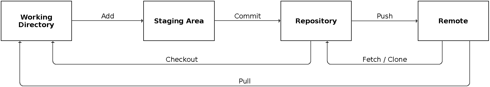
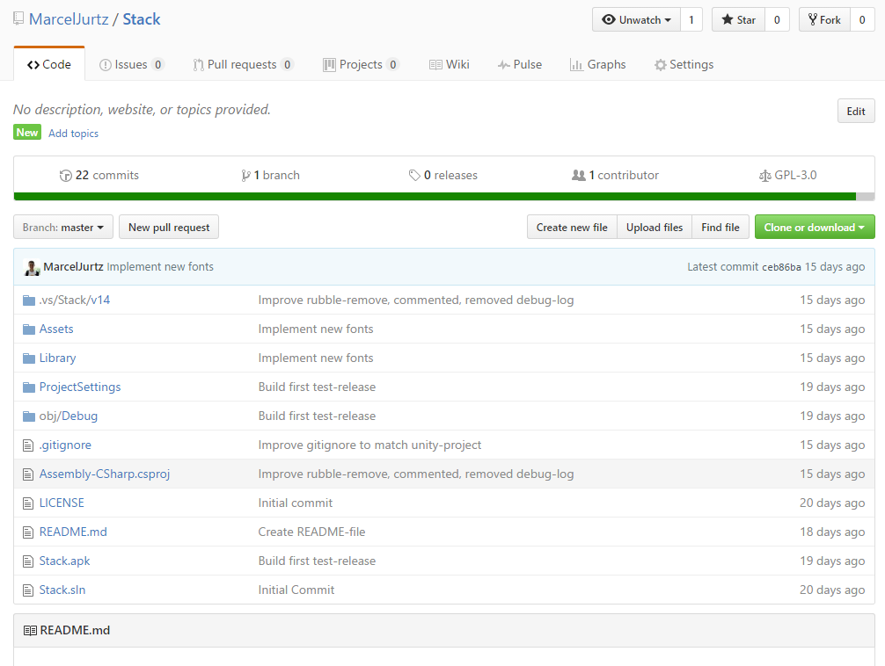

# Git Tutorial

This tutorial contains only an overview of version control with git, all shown parameters are only a small part of the available options.

## Git?

[Wikipedia:](https://en.wikipedia.org/wiki/Git)
> Git (/ɡɪt/) is a version control system (VCS) for tracking changes in computer files and coordinating work on those files among multiple people. It is primarily used for software development, but it can be used to keep track of changes in any files.

Git is a popular system for version control. Projects on git are called *Repositories*. Repositories can be used local or with a server. There is a diversity of free hosters, for example:
* [Github](https://github.com)
* [GitLab](https://about.gitlab.com/)
* [BitBucket](https://bitbucket.org)

## Installation

* Linux (Debian-based)

  ```Bash
  apt-get install git-all
  ```

* [Windows](https://git-for-windows.github.io/)
* [Mac](http://git-scm.com/download/mac)

## Elements

Git-Repositories are separated into *working directory*, *staging area* and *repository*. The working directory is the local copy of the repository.
Changes on the files are saved here. The repository is the shared project of all contributing persons. Using the staging area, a developert can decide, which elements he/she wants to save from the working directory to the staging area.


## Basic administration of a repository

All commands are initiated with the keyword *git*.

Initialization of a folder as repository:
```Bash
# New repository
git init

# Download (clone) of an existing repository
git clone /path/to/repository
```

Editing / creating files: test.txt

```Bash
# Overview of the current status of the repository:
git status
# -> test.txt is displayed red

# Splitting into separate parts:
# Untracked Files: New files
# Changes not staged for commit: Edited files

# Parameters:
# -u: Add all edited files, but no new ones.
# -A: Add all files (alternative: git add . )


# Adding files to the index
git add test.txt
# -> test.txt ist now displayed green

# Adding files to the repository
git commit -m "Add test"
```

Each commit is commented with the -m-flag.
This gives the developers a fast overview about the changes made.

Git has some [naming-conventions](https://github.com/erlang/otp/wiki/Writing-good-commit-messages), that tells you to write a commit
* short (<50 characters)
* written in present tense
* expressive


```Bash
# Print all commits including details in chronological order
git log
```

The output of this command looks like the following:


* SHA1-checksum
* Name of the author
* Email of the author

## Configuring names and emails

This configuration is global for every repository (set it up once per device).

```Bash
git config --global user.name "Marcel Jurtz"
git config --global user.email jurtzmarcel@gmail.com
```

You can set this for each project individually, just leave out the *--global*-flag.

## HEAD

In the following, *HEAD* is often mentioned. HEAD is the most recent commit of the current branch.

## Using Remotes

A remote is a repository on a server / different pc, for example hosted on Github.



In the following, I use Github as remote server.

After creating an account on [Github](https://www.github.com), available *repositories* are shown and new ones can be created.

When creating a new repository, you can select to add a README- and/or license- & .gitignore-file.

Es wird zu Beginn die Möglichkeit gegeben, eine README-, sowie eine license- und eine .gitignore-Datei anzulegen:

* README

	README is a info-file and (on github) shown to users, that are visiting the project page. README-files are usually written in markdown. Markdown is similar to HTML, but has lesser functionality and better readability (in my opinion).

	Markdown helps on creating clear textfiles.

* license

	All repositories on Github (free accounts) are public available. With a license-file, the usage of the repository can be adjusted to different preferences.

	Github offers some pre-defined licenses, for example MIT and GPLv3, along with information on the differences.

* .gitignore

	Gitignore-files list files and directories, that will be ignored by git. You can add files and folders, to, for example, prevent temp- or meta-files from being added to the repository.


The following screenshot shows an exemplary repository on Github.



The lading page offers some overview of a repository, for example the files and folders in the root-directory, amount of commits, branches, licensing-info and so on.

After a repository has been created, it can be added as a remote:

```Bash
git remote add origin url
```

You can set individual names for the remote, I use *origin* here.

To upload changes commited in the working directory, use the following:

```Bash
git push origin master
```

And this to download changes from a remote:

```Bash
git pull origin master
```

Please know, that if you have an existing project on your pc and want to add it to a remote, which already contains files, for example README, license, or .gitignore,
you'll have to merge the repositories. If you don't have any of these files locally, you'll have no problems, since the files will be automatically implemented.
If you do, this will result into a merge-conflict. Continue reading, to find out more about merging.

## Merging

For example, user A and user B are editing the same repository, both users can work with the above mentioned methods.
A problem comes up, when both users push the same file: merge conflicts.

Think of a file in the remote repository named test.txt, which has the following content:


```
Hello
```

Using pull, both users get this file to their working directories.  
Now, both users edit the file to the following:

Version A:

```
Hello, I am A!
```

Version B:

```
Hello, I am B!
```

Both users now push their version to the remote. The user submitting first will have no problems doing so. In my example, this will be user B.  
When user A pushes his updates, the push will result in an error like the following:


```
CONFLICT (content): Merge conflict in test.txt
Automatic merge failed; fix conflicts and then commit the result.
```

Git now modified the mentioned files, test.txt now has the following content:


```
<<<<<<< HEAD:test.txt
Hello, I am B!
=======
Hello, I am A!
>>>>>>> commit-text:test.txt
```

A now has to decide, which version is preferred and then commit the changes.  
A updates the file to the following:

```
Hello, we are A and B!
```

After that, he creates a new commit to document the merge:

```Bash
git add test.txt
git commit -m "Resolve Merge Conflict"
```

## Branching

Git uses *branches* to support developing new features. This supports developing new functionality, without the need to edited the working current version of the project.


Use this to create a new branch:

```Bash
git branch branch_name
```

And this to view all existing branches:

```Bash
git branch
```

The current branch is marked by an asterisk.
Usually, this is *master* in new projects.
As you may notice, we used this branch earlier to push commits.

Replace this to push to other branches.

Changing branches

```Bash
git checkout branch_name
```

Creating a branch and switching to it:
```Bash
git checkout -b branch_name
```

When a branch is changed, files in the working directory are automatically updated to match that branch.
This way, you don't have to use different folders for different branches and save space on your harddrive.

Die beiden Befehle können auch zusammengefasst werden:

To merge two branches, switch to the branch you want to merge to (using ```git checkout```) and merge them:
```Bash
git merge branch_name
```

To view differences in branches, you can use

```Bash
git diff source_branch destination_branch
```

Branches, that are no longer needed, can be deleted:

```Bash
git branch -d branch_name
```

## Tags

Tags can be added to commits, to highlight completed versions of a project. To select a commit, the first 10 characters of the checksum are needed (```git log```).

```Bash
# Creating a new tag
git tag 1.0.0 d525ac9ddf

# Show all tags
git tag

# Creating a commented tag
git tag 1.0.0 d525ac9ddf -m "Commented Tag"

# Show commit using its tag
git show 1.0.0
```

## Resetting changes

To reset contents of the working directory, you can use the following:

```Bash
git reset -- filename
```

This command obtains changes from HEAD and overwrites the content of the working directory to match HEAD.
Changes, that have been added to the staging area are not overwritten!

To reset contents of the directory, use this:


```Bash
git reset --hard d525ac9
```

As shown earlier, you need to add the first characters of the commits checksum to identify the commit.
This command should only be used with caution, since it changes the commit-history.

## Conventions & Good Practices

To keep repositories as clear as possible, you should follow some general rules in naming commits and branches.

### Commits

Commits should be written under considering the following:

* Keep it short and simple
* Begin with a normalized set of verbs, written in present tense, for example: *add*, *remove*, *update*

### Branches

It is useful to use a short and precise formulation here as well. Often, a verb as prefix is used to describe the purpose of the branch. For example: *add/feature_a*, *remove/feature_b*.

When contributing to public projects, you should also check the previous commits to adjust to the organization of the other authors.

## Alternatives

If you don't like using the terminal, there are some GUI-clients. For example:
* [SourceTree](https://www.sourcetreeapp.com/)

## Links

* [Git Reference](https://git-scm.com/docs)
* [Git Cheat Sheet](https://services.github.com/on-demand/downloads/github-git-cheat-sheet.pdf)
* [Markdown Tutorial](http://www.markdowntutorial.com)
